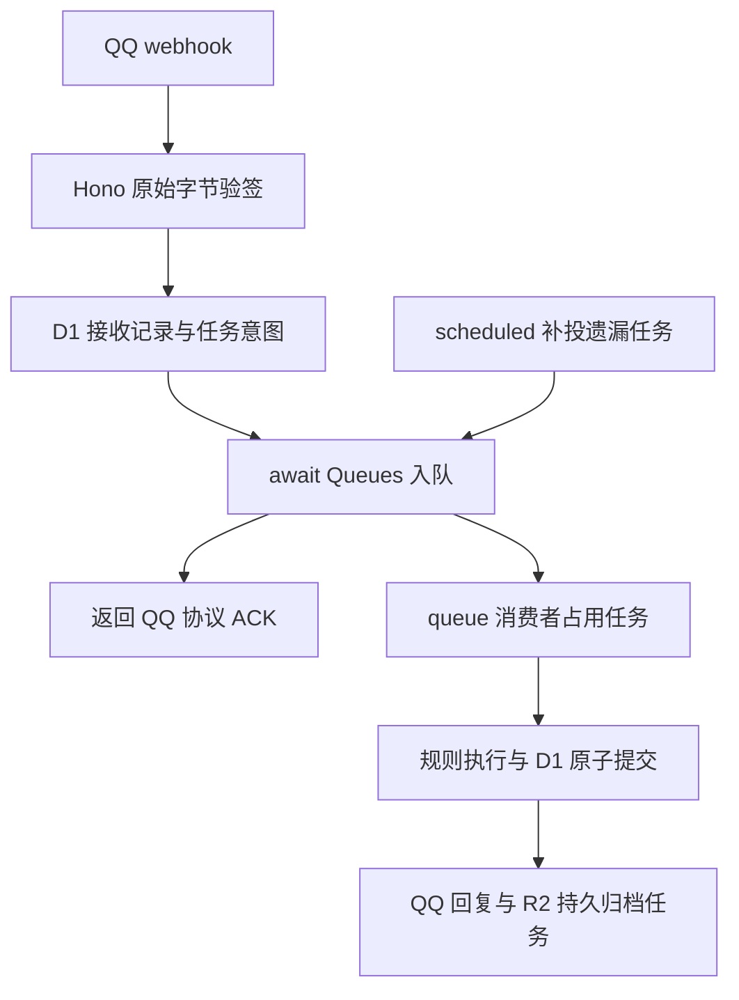

# DiceFunc Cloudflare Workers 规划设计

状态：**P0-P2 阶段已完成基础架构搭建**。核对日期：2026-09-18。
上次更新：2026-09-18 (Commit 54c5f0f) - 完成项目初始化、核心领域模型、适配器实现、CLI 工具、测试框架与文档。

依据：[功能清单](./SEALDICE_FEATURES.md)、本地 `sealdice-core`（提交 `4493693`）和本文引用的官方文档。功能清单用于确定迁移范围；具体命令语义以固定版本源码、测试及新增兼容用例为准，不能直接把清单中的概述当作完整规格。

## 1. 目标与决定

构建一个以 QQ 官方机器人 webhook 为入口、使用 TypeScript 7 实现的跑团服务。当前只实现 Cloudflare Workers，所需应用基础设施均使用 Cloudflare 托管服务；阿里云 ESA 及其他平台暂缓，不创建对应入口或适配器。先完成掷骰、角色卡和 COC7，再覆盖 DND5e、其他规则、牌堆、回复规则和日志。

采用领域建模与组合式面向对象设计。领域对象维护角色卡、战斗轮、日志等状态及不变量；应用服务组织命令；Hono 处理 HTTP 接入；适配器处理 QQ、D1、KV、R2 和 Queues。公式计算、判定和文本转换用纯函数。

| 事项 | 选定方案 | 职责与边界 |
| --- | --- | --- |
| 接入 | QQ 官方 webhook + Hono + Workers | 首批群聊 @ 消息与 C2C；无 WebSocket 连接 |
| 语言与工程 | TypeScript 7、ESM、pnpm workspace | 少量包组成模块化单体，不建设微服务体系 |
| 业务状态 | Cloudflare D1 原生 binding | 角色卡、会话、去重、结果、日志索引和任务状态 |
| 内容分发 | Workers KV | 缓存版本指针与不可变内容，不能保存权威游戏状态或锁 |
| 对象存储 | Cloudflare R2 原生 binding | 私有跑团日志归档、日志分片及配置包 |
| 执行 | Cloudflare Queues + D1 任务记录 | 持久接收、异步处理、重试和死信；消费需幂等 |
| 恢复 | Cron Trigger 有界补投/清理 | 应用任务恢复与日志保留规则，不建设运维系统 |
| 秘密 | Workers Secrets | 本地 1Password 注入，云端不运行 op |
| 运行时日志 | Workers Logs | 结构化、分级、字段白名单、脱敏，见第 12 节 |
| 配置和风格 | YAML → Schema 校验 → 不可变配置包 | 命名模板、变量契约、风格继承与 CLI 预览 |
| 扩展 | 构建时可信 TS 模块与声明式内容包 | 不承诺旧 Goja 插件原样运行或不可信代码隔离 |

当前不使用 PostgreSQL、Neon、Tablestore 或阿里云 OSS；按最新要求，原 OSS 归档方案改为 R2。“Cloudflare 全套服务”指所需基础设施在 Cloudflare 内完成，不是启用全部产品。首期不引入 Durable Objects、Hyperdrive、Workflows、Pages 或 Vectorize；只有实际需求证明必要时再评估。

明确不建设：WebUI 及管理 REST API、多社交平台、扫码登录、系统服务、托盘、容器部署方案、自动更新、运维控制台、定时系统备份和自动退群。平台绑定、队列消费、应用补投与日志清理是运行所需能力，不扩展为运维部署项目。

单个实例默认绑定一个 QQ App。不同风味机器人复用程序和内容包，各自配置 App、风格及数据命名空间。首期不做托管多租户产品。保留领域/适配器边界服务职责划分和测试，不为暂缓平台建立通用云框架。

## 2. 已核实的约束与验证门槛

### 2.1 QQ 能力按场景区分

webhook 的确认响应与发给用户的聊天消息是两条链路：前者按 QQ 回调协议返回，后者调用 OpenAPI。需分别处理地址验证 `op=13`、事件 `op=0`、确认 `op=12`，并按官方签名规范处理原始请求体。[事件订阅文档](https://bot.q.qq.com/wiki/develop/api-v2/dev-prepare/interface-framework/event-emit.html)

当前官方文档同时列出 `GROUP_AT_MESSAGE_CREATE` 和全量模式 `GROUP_MESSAGE_CREATE`。因此不能断言 QQ 永远无法记录普通群消息，但也不能默认每个 App 都已具备并启用全量接收能力。默认按已收到的 @ 消息与自身发送结果记录；全量模式通过测试 App 实际回调验证后才能开启。[消息场景](https://bot.q.qq.com/wiki/develop/api-v2/server-inter/message/overview.html)、[全量模式事件](https://bot.q.qq.com/wiki/develop/api-v2/autogen/event/group_message_create.html)

群聊被动回复当前文档约束为 5 分钟内、每条最多回复 5 次；`msg_id + msg_seq` 重复会失败。实现要保存稳定的分段序号、回复截止时间和消息预算；不同场景单独配置能力，不能把群聊规则直接套给 C2C。Markdown、富媒体、主动消息也不等于开通 webhook 就自动可用。[群消息接口](https://bot.q.qq.com/wiki/develop/api-v2/autogen/api/v2_groups_group_openid_messages.post.html)

暗骰不能在私聊失败后回落到群公开结果。群成员身份与 C2C 身份没有经过可信映射前，不互相推导。首期群内暗骰明确提示暂不支持；用户直接在单聊中执行普通检定可用。

管理员身份不能靠昵称、消息文本或未经证实的 QQ 群角色推断。骰主和群主持人通过配置中的带作用域身份指定；缺少平台角色证据时拒绝代改卡、管理日志和修改群设置。

### 2.2 Cloudflare 运行时与服务边界

领域代码不依赖常驻内存、磁盘文件、后台无限循环、进程锁或 Node 原生扩展。Workers 的 CPU、内存、子请求和后台执行有限；固定 compatibility date，按需启用兼容开关。`waitUntil` 不能代替持久队列。[Workers 限制](https://developers.cloudflare.com/workers/platform/limits/)

Workers KV 是最终一致存储，不能承担扣 SAN、无放回抽牌、事件去重、分布式锁或即时权限撤销。权威业务状态和访问控制使用 D1。[KV 一致性](https://developers.cloudflare.com/kv/concepts/how-kv-works/)

Queues 至少一次投递，业务必须容忍重复和乱序；入队成功、消费完成和 QQ 回复成功分别记录，不能互相替代。[Queues 投递语义](https://developers.cloudflare.com/queues/reference/delivery-guarantees/)

P0 验证 Hono 入口、随机数、Ed25519、D1 batch 回滚、KV 读取、R2 读写及 Queues 消费；独立云端测试资源验证实际绑定和 QQ 出站鉴权。若 App 的出站 IP 白名单不能由 Workers 满足，记录阻碍，不默认增加外部代理。队列等待计入 QQ 回复窗口，超时不改用主动消息。

### 2.3 TypeScript 7

采用正式 TypeScript 7 工具链；微软已发布 7.0 正式公告。实际施工时锁定可安装的具体补丁版本，不使用浮动 `latest`。首期无 Vue 等嵌入式模板语言，也不依赖编译器私有 API、旧 transformer 或运行时类型反射。[TypeScript 7.0 公告](https://devblogs.microsoft.com/typescript/announcing-typescript-7-0/)

## 3. 功能迁移矩阵

“后续”仍属于总体功能规划；“暂缓”不计入首轮交付。这里只承诺列出的语法与行为，不宣称完整 SealDice 替代品。

| 原清单范围 | 处理 | 计划内容及边界 |
| --- | --- | --- |
| 1 架构与会话 | 重构，P1 | 无常驻 DiceManager；请求上下文、持久化会话、命令注册表 |
| 2 平台适配 | 精简，P1 | QQ 群 @ 与 C2C；全量群消息及频道后续按权限接入；其他平台删除 |
| 3 基础表达式 | 保留，P2 | D/默认面数、算术、括号、keep/drop、优劣势、多次执行、原因文本 |
| 3 高级表达式 | 分期，P4/P6 | 属性变量与只读计算属性；骰池、比较、三元表达式后续；完整 dicescript VM 暂缓 |
| 4 核心命令 | 保留，P2/P3 | `.r/.rd/.roll`、`.set`、`.bot on/off`、`.userid`、`.help` |
| 4 管理命令 | 精简，P3 | `.black/.ban`、扩展开关、群主持人权限；`.master` 只留必要诊断，管理身份以文件为准 |
| 4 暗骰/名片/退群 | 暂缓 | `.rh/.rdh/.rah/.rch/.rxh/.drlh`、平台名片修改、踢人、禁言、自动退群；`.nn` 可仅修改本地显示名并明确提示 |
| 4 COC7 | 保留，P4 | `.ra/.rc`、奖惩骰、房规 0–5/dg、`.sc/.en/.coc/.ti/.li`；逐条对齐源码 |
| 4 DND5e | 保留，P5 | 技能/豁免、熟练、先攻、HP/临时 HP、死亡豁免、法术位、长休 |
| 4 其他规则 | 后续，P6 | WOD、Shadowrun、DX、共鸣性怪异、轮盘、`.who`；有界迭代 |
| 4 娱乐 | 保留，P6 | `.jrrp/.name/.namednd/.gugu/.ping`；姓名表与借口表作为数据资源 |
| 4 外部与主动交互 | 暂缓 | 魔都 API、SMTP 留言、定时推送、欢迎语主动发送；事件和回复权限实证后再开放 |
| 4 官方身份核验 | 不迁移 | 不冒用 SealDice 官方 `.check` 认证；自有版本信息由 `.about` 提供 |
| 5 角色卡 | 保留，P3/P4 | `.st`、`.pc/.char`、群内默认卡、独立卡、绑定、保存/加载、导入导出、公式属性 |
| 6 JS 插件 | 重设计，P6 | 可信 TS 模块的注册与钩子；Goja/`seal.*` 全兼容、动态执行、定时脚本暂缓 |
| 7 扩展包 | 部分保留，P6 | 内容包、依赖校验、启停、版本信息；在线商店、远程代码安装与热更新不做 |
| 8 跑团日志 | 保留，P7 | new/on/off/end/halt/stat/export；收到的消息与确认发送的结果；归档到 R2 |
| 9 牌堆 | 保留，P6 | 声明式牌堆、权重、嵌套、无放回、搜索；旧格式离线转换，无法转换时报错 |
| 9 自定义回复 | 保留，P2/P6 | 精确/包含/前后缀、all/any、有界条件、概率与冷却；不执行任意脚本 |
| 10 风控 | 精简，P1/P6 | 本地服务拒绝名单、权限、输入/输出审查、限流；拼音匹配后续；平台封禁/撤回动作不承诺 |
| 11 帮助检索 | 保留，P2/P6 | 命令帮助自动生成；小型规则资料构建索引、有界搜索，不迁移 Bluge |
| 12 随机数 | 替换，P2 | Web Crypto + 拒绝采样；`.randalgo` 仅报告使用方式，不迁移多算法切换与 DRBG 系统 |
| 13 WebUI API | 不迁移 | 配置 CLI、本地命令模拟器替代日常编辑与调试；不暴露管理后台接口 |
| 14 配置 | 重设计，P0/P2 | 文件拆分、风格包、Schema、覆盖来源、预览、版本及迁移 |
| 15 数据库 | 重设计，P1/P3/P7 | 新模型与显式迁移；旧数据离线导入后续，不自动运行旧版迁移链 |
| 16 运维 | 不迁移 | 不做系统服务、自动升级、部署自动化、运维备份、桌面功能 |

功能清单中的规则描述存在简化。例如 COC 房规与 SAN 行为必须分别核对 `ext_coc7.go` 的 `ResultCheckBase` 和各命令实现，不能根据表格摘要直接实现。每个保留命令建立 `compatibility.md` 条目：输入语法、状态变化、模板键、错误、权限、平台限制、测试用例、差异。

## 4. 技术栈

| 层次 | 选择 | 使用边界 |
| --- | --- | --- |
| 类型检查 | TypeScript 7、strict、noUncheckedIndexedAccess、exactOptionalPropertyTypes | tsc --noEmit；核心包不引入 Node 全局类型 |
| 构建 | ESM、Wrangler；CLI 使用 esbuild | 目标 ES2022，固定 compatibility date；构建不替代类型检查 |
| HTTP | Hono | webhook、健康检查、受限归档下载；业务不依赖 Hono Context |
| 配置 | yaml、Zod、JSON Schema | 本地解析 YAML，拒绝重复键和未知字段，限制别名展开；运行时读取编译 JSON |
| 表达式 | 有界 lexer + Pratt parser + AST evaluator | 不用 eval，不实现完整通用 VM |
| 业务持久化 | D1 + 参数化 SQLite SQL | 原生 binding、batch、Wrangler migrations；不引入 PostgreSQL 方言或存储过程 |
| 内容缓存 | Workers KV | 缓存不可变配置与发布指针，失效可回源 |
| 文件 | R2 binding | put/head/get/delete；Worker 鉴权下载，不需要 S3 AccessKey |
| 异步任务 | Queues、死信队列、Cron Trigger | 消费幂等，D1 保存任务事实，scheduled 补投与保留期清理 |
| QQ 签名 | Web Crypto，必要时 @noble/curves Ed25519 | 官方向量验证，不能自行设计算法 |
| 秘密/诊断 | Workers Secrets / Workers Logs | 字段白名单与专用日志适配器 |
| 测试 | Vitest + Cloudflare Workers Vitest integration | workerd/Miniflare 的 D1/KV/R2/Queues；独立云端测试验证服务实况 |
| 性质测试 | fast-check | 表达式、范围、模板和递归边界 |
| 格式与检查 | Biome | 限定修改范围 |
| 本地工具 | Node LTS + pnpm | CLI/构建/测试，不作为云端运行时 |

依赖在 P0 固定版本并核对 TS7、Workers 与许可证。表中是选型，不是已安装或已运行证明。[Hono Workers 接入](https://hono.dev/docs/getting-started/cloudflare-workers)、[Cloudflare 测试工具](https://developers.cloudflare.com/workers/testing/vitest-integration/)

Hono 路由为 `POST /webhooks/qq`、`GET /health`、`GET /archives/:id`。QQ 验签使用原始字节，覆盖 `timestamp + body`；按官方协议 `op=13` 回调验证请求不携带签名头，先解析 `op` 路由后再对其余事件验签。应用服务接收规范化值对象；`queue()` 与 `scheduled()` 是同一个 Worker 的独立入口，直接调用应用服务，不通过内部模拟 HTTP。

## 5. 代码目录与依赖

以下为目标结构，按施工阶段创建，不预先建立空包。当前 `sealdice-core/` 保持只读参考。

```text
dicefunc/
├── DESIGN.md
├── SEALDICE_FEATURES.md
├── package.json
├── pnpm-workspace.yaml
├── pnpm-lock.yaml
├── tsconfig.base.json
├── biome.json
├── apps/
│   ├── worker/
│   │   ├── wrangler.jsonc
│   │   └── src/
│   │       ├── index.ts
│   │       ├── http.ts
│   │       ├── queue.ts
│   │       ├── scheduled.ts
│   │       └── bindings.ts
│   └── cli/src/
│       ├── index.ts
│       ├── config-check.ts
│       ├── config-build.ts
│       ├── config-explain.ts
│       ├── reply-preview.ts
│       └── simulate.ts
├── packages/
│   ├── core/src/
│   │   ├── domain/
│   │   │   ├── identity/
│   │   │   ├── session/
│   │   │   ├── dice/
│   │   │   ├── character/
│   │   │   ├── rules/coc7/
│   │   │   ├── rules/dnd5e/
│   │   │   ├── rules/other/
│   │   │   ├── combat/
│   │   │   ├── deck/
│   │   │   ├── story-log/
│   │   │   └── policy/
│   │   ├── application/
│   │   │   ├── handle-event.ts
│   │   │   ├── execute-command.ts
│   │   │   ├── commands/
│   │   │   ├── export-log.ts
│   │   │   ├── deliver-reply.ts
│   │   │   ├── recover-jobs.ts
│   │   │   └── purge-logs.ts
│   │   ├── ports/
│   │   │   ├── state-store.ts
│   │   │   ├── reply-sender.ts
│   │   │   ├── archive-store.ts
│   │   │   ├── random-source.ts
│   │   │   ├── clock.ts
│   │   │   ├── job-queue.ts
│   │   │   └── runtime-logger.ts
│   │   ├── presentation/
│   │   │   ├── reply-events.ts
│   │   │   ├── template-renderer.ts
│   │   │   └── message-planner.ts
│   │   └── extensions/registry.ts
│   ├── config/src/
│   │   ├── schemas/
│   │   ├── compiler/
│   │   ├── merge.ts
│   │   └── migrations/
│   └── adapters/src/
│       ├── qq/
│       │   ├── webhook.ts
│       │   ├── signature.ts
│       │   ├── event-mapper.ts
│       │   ├── token-provider.ts
│       │   └── reply-sender.ts
│       ├── d1/
│       │   ├── state-store.ts
│       │   ├── commit-plan.ts
│       │   └── migrations.ts
│       ├── r2/
│       │   ├── archive-store.ts
│       │   └── story-chunks.ts
│       ├── kv/config-cache.ts
│       ├── queues/job-queue.ts
│       └── observability/
│           ├── runtime-logger.ts
│           └── redact.ts
├── config/
│   ├── bot.yaml
│   ├── access.yaml
│   ├── storage.yaml
│   ├── limits.yaml
│   ├── logging.yaml
│   ├── rules/coc7.yaml
│   ├── rules/dnd5e.yaml
│   ├── groups/example.yaml
│   ├── flavors/classic/manifest.yaml
│   ├── flavors/classic/replies/core.yaml
│   ├── flavors/classic/replies/coc7.yaml
│   ├── flavors/gothic/manifest.yaml
│   ├── flavors/gothic/replies/coc7.yaml
│   ├── custom-replies/default.yaml
│   ├── decks/
│   └── help/
├── schemas/
├── migrations/
├── tests/
│   ├── fixtures/qq/
│   ├── fixtures/compatibility/
│   ├── integration/
│   ├── contracts/
│   └── runtime/
├── docs/
│   ├── configuration.md
│   ├── template-reference.md
│   ├── compatibility.md
│   ├── testing.md
│   └── logging-and-retention.md
└── sealdice-core/
```

依赖方向：`apps → adapters + config + core`；`adapters → core 的 ports`；`core/domain` 不导入 adapters、QQ SDK、云厂商类型或配置解析器。配置编译器可引用公开的命令/模板契约，core 不反向依赖配置编译器。扩展先放在 core 内，出现独立发布需求时再拆包。

测试可与纯计算模块同目录；`tests/integration` 集中验证真实组件协作。Workers binding 类型限于 worker app 和适配器的 tsconfig，防止 Node 类型掩盖边缘不支持的 API。

## 6. 面向对象设计与公共契约

| 对象 | 职责与不变量 |
| --- | --- |
| `ConversationSession` | 当前规则、默认面数、开关、绑定与日志引用；关闭后仅允许帮助和授权恢复命令 |
| `CharacterSheet` | 所有者、规则、属性、版本；修改通过规则策略校验，不允许任意写整个 JSON |
| `CocRuleSet` / `DndRuleSet` | 实现小型 `RuleSet` 契约；内部判定用纯函数组合，避免巨型基类 |
| `CombatEncounter` | 先攻条目与当前轮状态；插入、删除、排序规则集中管理 |
| `DeckSession` | 无放回剩余项、重置、版本；递归预算由执行上下文统一消费 |
| `StoryLog` | recording/paused/closed；关闭后不可继续追加，归档状态独立 |
| `CommandRegistry` | 命令、别名、权限、规则限定、帮助元数据；构建时发现冲突 |
| `CommandExecutor` | 加载快照、执行策略、生成提交计划；不直接发送 QQ 或写 R2 |
| `TemplateRenderer` | 只处理已验证数据与模板，不能读库、调用网络或再次掷骰 |
| `MessagePlanner` | 按场景预算转为确定的消息段；超长内容分页而非无限拆发 |

核心接口的预期形状如下，字段细节由 P1/P3 测试固定：

```typescript
interface StateStore {
  claimEvent(event: VerifiedEvent): Promise<EventClaim>;
  loadSnapshot(scope: CommandScope): Promise<StateSnapshot>;
  commit(plan: CommandCommit): Promise<CommitOutcome>;
}

interface CommandHandler<I> {
  execute(input: I, context: CommandContext): CommandDecision;
}

interface ReplySender {
  send(message: PreparedReply): Promise<DeliveryOutcome>;
}

interface ArchiveStore {
  put(archive: PreparedArchive): Promise<ArchiveReceipt>;
  read(receipt: ArchiveReceipt): Promise<ArchiveContent>;
}

interface RandomSource {
  integer(minInclusive: number, maxInclusive: number): number;
}
```

`CommandDecision` 包含状态变更、结构化业务结果和回复事件，例如 `coc.check.failed` 与技能/目标值/骰点。业务层不拼接中文句子。`CommandContext` 注入时钟、随机源、权限结果、预算和配置版本，不注入可以访问任意模块的全局容器。

`CommandCommit` 是有限的、带类型的变更集合，不是可执行 SQL 或任意 JSON Patch。只有数据库适配器知道如何提交它。依赖在应用入口显式构造，首期不引入 DI 框架、事件总线或通用工作流引擎。

下载授权由应用层 ArchiveAccessService 管理，先校验权限、记录授权审计再签发短期链接；ArchiveStore 只处理对象读写，不自行决定谁能下载。

## 7. 消息处理、事务与恢复



### 7.1 接收、排队和顺序

1. 限制方法、路径与请求体大小，读取一次原始字节；签名密钥由 AppSecret 按官方算法派生（重复填充至 32 字节 seed），验签与 `op=13` challenge 应答共用该密钥，官方向量逐字节验证。未知但合法事件确认并忽略。
2. 核对 App、场景和事件 ID；消息唯一键包含 bot、场景、会话和 message ID。不同接收事件类型映射到同一规范化消息时复用业务去重键，不按文本哈希去重。事件没有 ID 时只使用已核实的协议字段。
3. 在 D1 中原子保存接收记录、随机种子、配置摘要、会话接收序号和 `jobs` 任务意图。配置按摘要保存到不可变版本记录，不能只依赖未来某个 Worker 版本仍携带旧 bundled 配置。
4. await Queues.send 成功后才返回成功 ACK；失败返回可重试响应。D1 与 Queues 不存在跨服务事务，重投需再次入队而不能因 inbox 已存在直接跳过。入队成功后更新状态失败允许重复入队。
5. queue 消费者通过 D1 原子占用任务租约和 fencing token，加载配置与领域快照。完成业务提交后再次消费同一任务只推进未完成的副作用，不重新掷骰。
6. 同会话命令按 D1 分配的接收序号处理，后到的消费若存在未完成前序命令则延迟重试；终态失败也推进序号。此顺序代表本服务接收顺序，不声称还原 QQ 未保证的真实发送顺序。跨群共享卡通过版本校验避免丢失更新。

D1 存了 inbox 不等于队列必定收到：scheduled 按 next_attempt_at 分页补投待入队/租约过期任务，防止写库后进程中断导致永久遗失。为命令、回复、日志归档分别设置重试次数、退避、截止与失败原因，死信队列保留有界恢复窗口；补投次数统一计入 D1 总尝试预算，不能通过补投绕过重试上限。[Cron 入口](https://developers.cloudflare.com/workers/configuration/cron-triggers/)

新命令超过处理截止且未提交时标为 expired，不延迟数小时后突然扣血；已提交结果保留，回复窗口过期只标投递过期。用户可用新消息 `.result <执行ID>` 查询既有结果。队列只携带内部任务 ID、类型和版本，不携带聊天正文、随机种子、凭据或下载 token。

### 7.2 D1 状态原子提交

使用单个 D1 数据库保存当前实例的所有事务状态，避免跨数据库事务。首期不启用读副本；将来启用时需单独验证 Sessions/bookmark 一致性，不能把一次 session 当作数据库事务。

D1 `batch()` 可以原子执行预构建 SQL 并在语句失败时回滚；不把多次独立调用包成假想的交互事务，也不移植 PostgreSQL 的存储函数或行锁语法。[D1 batch](https://developers.cloudflare.com/d1/worker-api/d1-database/#batch)

选定“读快照 → TS 计算 → batch 校验并提交”：

- 读取会话、卡绑定、卡、权限和牌堆的完整版本集合。范围查询与创建/删除使用聚合版本，不能只验证实际修改的行。
- 适配器生成一组参数化语句：先插入提交守卫，使用 CHECK 约束要求所有预期版本、租约 token、未处理状态和会话序号条件成立；再写状态、结果、日志待归档条目、回复和任务记录；最后完成事件并移除临时守卫。
- 守卫条件不满足必须导致 SQL 约束错误，使整个 batch 回滚。仅执行 `UPDATE ... WHERE version = ?` 而忽略影响 0 行，不构成事务失败；禁止这种“部分业务成功”的实现。
- 守卫表结构、SQLite CHECK 断言与 batch 回滚行为必须先做 D1 原型及故障测试；不能假设所有 SQLite/ORM 事务接口在 D1 可用。
- COC 判定、HP 抵扣和模板选择仍在 TS；数据库只负责条件、唯一性、引用与原子提交。类型化 CommandCommit 不能包含任意 SQL 或表名。
- 一次提交同时记录业务结果、状态变化、入站日志待归档条目及外部副作用意图。只有提交成功才发送 QQ 或向 R2 写最终归档。
- 版本冲突有限重试，重新加载快照，用事件持久种子重放随机流，不重抽骰运。旧租约执行者不能越过新的 fencing token。
- 提交超时先查 execution ID 判断是否已提交，不能直接假定回滚。

不引入外部数据库或备用数据库方言。跨群共享卡仍可在同一 D1 内实现；如果规模超过单库能力，另行设计分片边界，不提前牺牲当前事务语义。

### 7.3 回复与副作用恢复

D1、QQ 与 R2 之间没有分布式事务。目标是业务状态至多提交一次、外部效果可追踪可恢复，不宣称端到端 exactly-once。

回复在业务事务内冻结模板摘要、文本、收件场景、原消息 ID、分段序号及截止时间。consumer 优先尝试发送，临时失败由 Queues 重试相同回复意图；超长内容保留摘要和 `.more <游标>`，续页绑定会话、用户和期限，使用新请求的回复上下文。

下载授权消息是例外：持久回复计划只保存归档/授权引用，明文 bearer token 只在签发与发送的当次内存中存在，不写 outgoing_messages、command_results 或跑团正文。发送结果不确定时不自动更换正文重发；用户再次申请则撤销旧授权并用新消息上下文签发。跑团记录将下载链接替换为不含授权信息的“已提供归档下载入口”。

投递状态为 pending/sending/sent/unknown/failed/expired。发送成功才记录平台消息 ID；超时保留 unknown，并复用同一个 msg_id + msg_seq，不能换序号绕过去重。重复错误不自动等于已成功投递；凭据刷新和 429 重试都受预算与回复期限约束。

日志分片与归档是独立任务，失败不回滚已完成的骰点，但必须显示归档未完成并保留 D1 待归档数据。消费者显式 ack/retry；队列和 scheduled 重复执行共享同一份 D1 幂等状态。

## 8. 数据模型

所有资源主键和唯一索引均含 `bot_id`。QQ OpenID 带场景与群作用域存储，不当作可跨 App/跨群/C2C 通用的 QQ 号码。

| 表 | 关键字段/约束 |
| --- | --- |
| `conversations` | scene、external_id、enabled、rule_set、settings_override、version；作用域唯一 |
| `principals` | scene、scope_id、external_id；未经证实不合并身份 |
| `character_sheets` | owner_id、rule_set、name、attributes JSON 文本（TEXT + json_valid 校验）、version；所有写操作验证所有权 |
| `character_bindings` | conversation_id、principal_id、sheet_id、version；每人每会话一个当前绑定 |
| `character_snapshots` | sheet_id、snapshot_id、schema_version、attributes；保存与加载的显式快照 |
| `encounters` / `deck_sessions` | conversation_id、state、version；按领域聚合更新 |
| `policy_entries` | 主体/群作用域、deny/trust、原因、version；文件限制与运行时处罚分离 |
| `rate_buckets` | bot/user/conversation 作用域、token、updated_at；数据库时间原子扣减 |
| `received_events` | event_id、message_key、conversation_seq、status、config_digest、seed、lease、fencing_token、result_id |
| `command_results` | execution_id、结构化结果、规则版本、创建时间；重复消息引用同一结果 |
| `outgoing_messages` | execution_id、part、msg_seq、deadline、status、platform_message_id；分段唯一 |
| `story_logs` | conversation_id、name、status、revision；每会话至多一个正在记录的日志 |
| `story_log_items` | log_id、顺序号、方向、source_id、短期正文、delivery_status、chunk_id；来源唯一，R2 校验成功后清理正文 |
| `log_archives` | log_id、snapshot_cursor、format、object_key、digest、status、expires_at、deletion_status、error_code |
| `jobs` | type、resource_id、status、attempts、next_attempt_at、deadline、lease、fencing_token；幂等唯一键 |
| `commit_guards` | transaction_id、通过 CHECK 约束的版本断言；仅用于 batch 原子校验 |
| `config_releases` | digest、bundle/对象引用、schema_version、revision；旧事件可读取原版本 |
| `story_chunks` | log_id、first_seq、last_seq、object_key、sha256、bytes、verified_at；分片范围唯一 |
| `archive_grants` | token_hash、archive_id、expires_at、revoked_at、scope；只保存令牌哈希 |
| `log_audit_events` | action、资源 ID、操作者作用域 ID、时间、结果；无聊天正文或 token |
| `schema_migrations` | 使用 Wrangler D1 migrations 记录；发布工具附带校验清单，不另建并行迁移体系 |

共享角色卡被多个群绑定时修改会共同可见，必须由 `.pc tag` 明确提示；默认群内卡完全隔离。跨群操作（如 untagAll）验证同一 owner，受同一个事务约束。

禁止请求处理器自动执行数据库迁移。新项目只建所需新表；旧数据库、QQ 身份映射和旧人物卡由后续离线导入器处理，先 dry-run，不能按昵称合并。配置版本、角色属性 schema 版本、规则版本和数据库版本分别管理。

## 9. 配置文件：编辑体验与生效规则

### 9.1 配置职责

| 文件 | 编辑内容 | 不存放内容 |
| --- | --- | --- |
| `bot.yaml` | bot ID、App ID、默认风格、默认规则、启用模块、配置来源模式 | 密钥明文、角色卡 |
| `access.yaml` | 骰主、群主持人、强制拒绝名单、可改字段 | 根据昵称猜测的管理员 |
| `storage.yaml` | D1/KV/R2/Queues 绑定名、对象前缀、下载和归档限制 | S3 AccessKey、账号管理 token |
| `logging.yaml` | 运行时日志级别/字段策略、跑团日志保留和下载规则 | 正文、凭据、下载 token |
| `limits.yaml` | 输入、表达式、牌堆、输出和请求预算 | 可绕过平台限制的无限值 |
| `rules/*.yaml` | 房规选择、属性默认值、别名、有界公式 | JS 函数、任意代码 |
| `groups/*.yaml` | 群规则默认值、风格、权限及允许覆盖项 | 每条命令产生的状态 |
| `flavors/*` | 人设显示名、命名文案、语气与加权候选 | 规则结果与权限逻辑 |
| `custom-replies/*` | 匹配条件、优先级、模板动作、冷却 | 网络调用与脚本执行 |

YAML 支持多行文案，使用 JSON Schema 在编辑器中补全与校验。提供完整参考文档和最小模板，不要求使用者阅读源码寻找字段。错误定位到文件、行列和属性路径；严格拒绝拼错字段、重复键、非法权重和悬空引用。

### 9.2 示例

`config/bot.yaml`：

```yaml
schemaVersion: 1
bot:
  id: investigator
  displayName: 守秘海豹
qq:
  appId: "YOUR_QQ_APP_ID"
  appSecretBinding: QQ_APP_SECRET
  scenes: [groupAt, c2c]
defaults:
  ruleSet: coc7
  diceSides: 100
  flavor: gothic
  timezone: Asia/Shanghai
modules: [core, character, coc7, deck, customReply, storyLog]
configSource:
  mode: bundled
```

`config/storage.yaml`：

```yaml
schemaVersion: 1
database:
  provider: cloudflare-d1
  binding: DB
configuration:
  cacheBinding: CONFIG_KV
  bucketBinding: CONFIG_BUCKET
jobs:
  commandQueueBinding: COMMAND_QUEUE
  archiveQueueBinding: ARCHIVE_QUEUE
storyLog:
  archive:
    provider: cloudflare-r2
    bucketBinding: STORY_LOG_BUCKET
    prefix: dicefunc/investigator/logs/
    formats: [txt, json]
    visibility: private
    maxExportBytes: 4194304
```

这里的 4 MiB 是首版导出保护阈值，需按 P0 测量调整，不是 R2 限额。下载期限只在 logging.yaml 的 grantTtlSeconds 定义，避免重复配置。配置只选择已经声明的 binding，不会自动创建云资源；wrangler.jsonc 保存各环境资源 ID、绑定、队列和 compatibility date。业务 YAML 不重复保存 bucket 实体名称，防止两套配置漂移。

秘密由绑定解析器读取。Git 只保存非敏感设置、绑定名和 `op://<vault>/<item>/<field>` 引用；本地 CLI 用 `op run --env-file=... -- ...`，云端使用 Workers Secrets 和资源 bindings，不运行 `op`。account/vault/开发与测试身份在施工环境确定后记录；不默认创建个人 vault 条目。检查/预览/诊断只输出绑定是否存在，不输出明文。

### 9.3 合并和命令修改

业务设置顺序：内置默认值 → 全局文件 → 群文件 → 数据库中的允许覆盖项。权限、安全上限、秘密和基础设施字段不能被群命令覆盖；限额取硬上限与配置值中的更严格值。

映射按字段覆盖，数组整体替换；`null` 只在 Schema 显式允许时有意义；禁用用 `enabled: false`，不发明隐式删除语法。风格继承按模板键覆盖，每个键的候选列表整体替换，最多 4 层，禁止循环。

`.set coc`、`.set 20`、`.bot off` 写运行时 override，不回写 YAML。文件是默认值与硬约束的来源，DB 是可变游戏状态的来源。`.set reset <字段>` 删除 override 后重新继承文件；`config explain` 展示最终值及来源，避免改了文件却不生效而无法理解。

群文件通过 `mutableSettings` 限定允许修改项；更新后不再允许的旧 override 自动停止生效并报告，不静默重新解释。操作者不能用关闭机器人跳过权限检查，授权 `.bot on` 必须在关闭状态仍能工作。

### 9.4 文件如何进入 Worker

P0/P2 默认 bundled：本地编译 YAML 为规范化 JSON、模板 AST、Schema 版本与摘要，随应用构建。修改文件需重新构建运行产物，不能把本地保存称为云端热生效。接收事件前确保该摘要的非敏感业务配置已保存到 D1 config_releases，旧任务可按摘要重放；Secrets 不进入配置包。

P6 增加可选 `cloudflare-versioned`：CLI 将验证后的不可变包写入私有 CONFIG_BUCKET，再在 D1 用 expected revision 条件更新发布记录。D1 是发布指针的权威来源；只有 CAS 成功才更新 KV 缓存。KV 更新失败记录待刷新，不撤销已经提交的 D1 发布。定期刷新任务读取当前 D1 revision，避免旧发布任务覆盖新指针。

运行时可从 KV 读指针/内容；缓存未命中或版本包缺失时回源 D1/R2。包必须核对摘要、Schema 和全部引用后整体切换，不能部分更新。低频 TTL 校验 D1 当前 revision，避免失效的 KV 指针无限期生效。热实例保留上一有效包；冷启动拿不到有效包时返回可重试错误，不能用任意默认值处理命令。

远端包只更新规则、风格和内容。App、权限硬边界、bindings 与配置源自身留在 bootstrap；权限可变状态仍以 D1 为准。每个事件固定摘要，保留原包至少覆盖任务/结果保留窗口。新代码必须能解释待处理的旧 schema，否则升级前需完成或明确终止旧任务。

KV 刷新是最终一致，不承诺全球同时切换，也不承担即时撤权。发布/回退只操作内容版本，不建设自动部署系统。R2 包与业务日志分桶授权，配置工具不授予跑团日志访问权限。

### 9.5 CLI 验收命令

以下均为计划接口，当前尚不存在：

```text
pnpm dice config init --flavor gothic
pnpm dice config check --dir ./config
pnpm dice config build --dir ./config
pnpm dice config explain --group qq-group/example --key defaults.ruleSet
pnpm dice reply preview coc.check.failed --flavor gothic --fixture failed-check
pnpm dice simulate --scene groupAt --message ".ra 侦查 60" --fixture investigator
pnpm dice config diff --from ./previous --to ./config
pnpm dice config migrate --dir ./config --dry-run
```

P6 可增加 `config publish` 和 `config rollback`，需显式环境及目标对象。普通 check/preview/simulate 不连接 QQ、Cloudflare 远端资源或生产库；模拟器用隔离状态。迁移默认预览差异，写入时保留原文件，不静默改风格文本。

## 10. 回复模板与自定义回复

### 10.1 模板契约

每个回复事件维护变量 Schema，例如 `coc.check.failed` 只提供 actor、skill、target、roll、reason 等已计算字段。模板编译时拒绝不存在变量；预览覆盖所有候选。必填槽位由事件契约定义，例如技能检定必须显示目标值与出目，风格不能隐藏关键结果造成歧义。

`config/flavors/gothic/manifest.yaml`：

```yaml
schemaVersion: 1
id: gothic
extends: classic
displayName: 古典怪谈
files:
  - replies/coc7.yaml
```

`config/flavors/gothic/replies/coc7.yaml`：

```yaml
schemaVersion: 1
templates:
  coc.check.failed:
    variants:
      - id: whisper
        weight: 3
        text: |-
          {{actor.name}}凝视着阴影，阴影没有回答。
          {{skill.name}}检定：{{roll.total}} / {{target.value}}，失败。
      - id: silence
        weight: 1
        text: |-
          真相从{{actor.name}}的指间溜走。
          {{skill.name}}：{{roll.total}} / {{target.value}}，失败。
```

首期语法仅白名单变量插值和字面量，不支持函数调用、任意表达式、属性原型访问、动态 include 或模板内掷骰。不同成功等级使用不同事件键。模板 AST 编译好后执行，限制模板数、候选数与输出长度。

带权选文案使用与骰点分开的随机流；增加候选不会改变业务出目。选定 variant ID 与最终文本进入回复记录，重试不换文案。缺键沿风格继承回退到 classic；显式覆盖的非法键在编译时失败。运行时异常使用内置最小错误消息，不能导致已提交命令再次执行。

人物名称和原因属于数据，不重新作为模板解析。QQ 文本/Markdown 转义在平台适配器完成，模板不能注入任意 @、隐藏消息段或平台控制字段。

### 10.2 自定义回复

自定义回复决定“何时回复”，模板决定“怎么说”，两者分开配置。示例：

```yaml
schemaVersion: 1
rules:
  - id: greeting
    enabled: true
    priority: 100
    scenes: [groupAt, c2c]
    match:
      exact: 你好
    cooldown:
      scope: user-in-conversation
      seconds: 30
    action:
      template: custom.greeting
    stop: true
```

处理顺序固定：验权/审查 → 核心命令 → 当前规则命令 → 启用扩展 → 非命令回复。命令别名冲突必须显式绑定；禁止靠文件加载顺序决定 `.ra` 属于 COC 还是 DND。普通自定义回复不得截获管理命令。

首期匹配只支持精确、包含、前后缀、长度、all/any 和白名单只读条件。任意正则推迟到确定线性时间引擎及Workers 构建可行后；单纯设置 JS timeout 无法安全中断同步灾难性回溯。冷却在数据库中原子判定，不依赖进程内 Map。

完整群聊天自定义回复以实际开放的全量事件为前提；@ 模式下不会响应从未收到的普通消息。动作只允许当前可回复场景的模板响应，群转私聊和运行脚本暂缓。

## 11. 表达式、规则与扩展

### 11.1 骰点核心

P2 先实现 token → AST → 有界求值，表达式解析与原因文本分离，明确乘方结合性、负号优先级、keep/drop 冲突、默认骰面与多轮语法。所有数字范围和取整规则成为兼容用例，不用 JS 隐式转换决定业务行为。

P4 加入属性名/别名、只读计算属性与依赖环检测；P6 加入骰池、比较与三元。基础属性与计算属性分开；计算属性不能修改其他属性或无限递归。

建议起始保护值：输入 2 KiB、AST 512 节点、递归深度 32、单指令总掷骰 1000 次、重复执行 10 次、模板继承 4 层、牌堆递归 16 层。均为产品初始值，P0 基准验证后调整；CPU 总预算覆盖解析、抽牌、规则与渲染，不能各层独立重置预算。

Web Crypto 提供熵；整数采样使用拒绝采样避免模偏差。持久化事件种子派生业务流/文案流，使用标准密码原语，不自创 PRNG。`.jrrp` 用 bot、带作用域身份、配置时区日期及专用秘密派生，与命令随机流分开，明确换身份或换 bot 后值可变。

### 11.2 规则边界

COC7：房规、奖惩骰、属性别名、SAN、成长和制卡各自有纯计算测试；SAN 扣减及成长写卡必须做真实数据库集成测试。一天累计 SAN 的边界应为游戏日而非直接等同系统日期；自动发疯判断若与原行为不同，记入兼容说明并提供主持人显式重置。

DND5e：HP、临时 HP、死亡豁免、法术位属于角色卡不变量；先攻属于群战斗聚合。长休一次事务完成全部变化。平台自动群名片联动不做，回复模板可显示 HP 与角色名。

可信扩展实现 registerCommands、配置 Schema、帮助和模板契约。钩子只接收受限上下文，不能绕过授权入口。模块与宿主同权限运行，这不是隔离沙箱。声明式内容包可导入牌堆、帮助和模板，检查依赖循环、路径穿越、数量、大小及版本；不下载远程 JS 执行。

帮助先精确匹配命令与词条，再使用构建期中文分词/索引数据做有限检索。规则书正文、姓名表、牌堆等单独核查来源和授权；仓库代码许可证不代表所有第三方素材都能重新分发。

## 12. 日志标准与 R2 保护

两类日志必须分别建模、存放、授权和清理。跑团正文不进入 Workers Logs，运行诊断不混入玩家的跑团归档。以下是实施要求，不是已经具备的保护措施。

### 12.1 分类与存储标准

| 类别 | 内容 | 权威存储 / 保留 | 权限 |
| --- | --- | --- | --- |
| 运行时诊断 | 状态、耗时、错误码、重试与资源失败 | Workers Logs；按实际套餐保留期，不作为审计唯一来源 | 仅项目维护者最小只读日志权限 |
| 跑团日志 | 实际收到的对话、骰点、发送结果和规则版本 | 私有 R2；D1 暂存待归档正文与索引 | 当前群配置的日志管理者可申请导出 |
| 日志访问审计 | 启停、导出、授权、下载、撤销与删除 | D1 独立审计表，默认 90 天 | 维护者；普通玩家无查询接口 |
| 执行恢复数据 | inbox、结果、回复意图、随机种子 | D1 有界保留，与剧情归档分开 | 仅应用内部；用户只可按权限查询结果 |

运行诊断基线按 Workers Paid 保留 7 天设计；当前官方文档的 Free 保留 3 天，使用 Free 时必须明确记录为较短诊断窗口。平台保留期不是修改 logging.yaml 就能延长的参数。本期不将运行时日志另行导出到 R2，R2 的重点保护对象为跑团正文；需要长期保留的访问审计放 D1。[Workers Logs 保留期](https://developers.cloudflare.com/workers/observability/logs/workers-logs/)

默认跑团日志关闭；日志管理者用 `.log new/on` 开启，在当前会话提示记录范围、保留策略及谁能导出。不开启时不为了“调试”长期收集普通聊天。开启只记录平台实际收到的事件；全量模式需要实际能力验证。

建议初始保留策略：剧情正文不自动过期，配置中必须显式写 `archiveRetentionDays: null` 表示管理者选择保留至主动删除，禁止用缺失字段暗示永久保留。可改为明确天数。已归档的 D1 暂存正文在 24 小时清理窗口内移除；未归档正文不得被普通 TTL 清除。执行结果/回复恢复数据默认 7 天，去重 tombstone 默认 30 天且必须覆盖已核定的最大重放窗口。更短设置不能绕过任务截止和重放要求。

日志删除必须同时覆盖执行恢复数据中属于该日志的正文副本；角色卡是独立业务数据，不因删除剧情日志被连带删除。平台备份/Time Travel 可能在其保留窗口内仍包含历史数据，删除说明不得宣称即时物理抹除所有副本。

### 12.2 运行时日志的强制规范

所有应用诊断通过 `RuntimeLogger`，除该适配器外不直接调用 console；lint/代码检查禁止散落的原始打印。使用 JSON 结构化记录，稳定字段包括：

```json
{
  "schemaVersion": 1,
  "timestamp": "2026-09-18T10:00:00.000Z",
  "level": "warn",
  "event": "qq.reply.retry",
  "component": "reply-sender",
  "environment": "test",
  "requestId": "req_example",
  "executionId": "exec_example",
  "jobId": "job_example",
  "outcome": "retryable",
  "errorCode": "QQ_RATE_LIMITED",
  "attempt": 2,
  "durationMs": 123,
  "httpStatus": 429
}
```

- debug：本地诊断；生产默认关闭，不能通过群命令开启。
- info：一次请求/任务的开始或完成、配置版本切换等必要事件，默认记录完成摘要，避免每个 SQL/骰点打印。
- warn：可恢复故障、重试、超限和归档延迟；重复验签攻击按窗口聚合计数。
- error：任务终态失败、状态不变量失败、R2 校验不一致、正文积压达到保护阈值。
- 禁止记录 AppSecret、token、Authorization/Cookie、完整 URL/query、下载令牌、环境对象、原始请求/响应体、昵称、OpenID、人物卡、聊天正文和模板渲染结果。必要的参与者关联采用专用秘密 HMAC 伪名，不使用可枚举的无盐哈希。
- 错误用固定 errorCode 和白名单元数据；不直接序列化 Error/cause、SDK 返回对象或对方错误正文。堆栈只保留通过过滤的代码位置，去除消息、URL 和用户输入。
- 字段白名单先于递归脱敏；单条序列化后最多 8 KiB，超限丢弃可选元数据并记录 truncated。外部文本不能伪造 level/event 等字段。
- 应用对正常高频摘要可采样，warn/error 不主动采样；平台配额/采样仍可能丢日志，因此任务状态与安全审计必须在 D1。诊断写入失败不得使骰点事务重复执行。

Worker invocation 自动日志、Hono logger、Tail 与控制台异常都要审查，不能只检查自写 console。归档下载路由尤其不能把含授权 token 的 URL 交给默认访问日志；在 wrangler 设置 observability.logs.invocation_logs 为 false，使用白名单应用事件替代，并在测试验证平台实际输出。head_sampling_rate 默认设为 1，正常事件采样在应用层执行，避免请求级采样一并丢掉 warn/error。仅开关配置不算脱敏已生效。[Workers Logs](https://developers.cloudflare.com/workers/observability/logs/workers-logs/)

### 12.3 跑团正文持久化流程

`.log new/on/off/end/halt` 更新 StoryLog。`end` 冻结序号游标、关闭记录并创建归档任务；`halt` 关闭且不生成分享归档，但已收录正文仍必须完成 R2 持久化，不能成为只留在 D1 的例外。

1. 接收/业务提交时将去重后的日志条目与 `archive-chunk` 任务意图原子写入 D1。未确认发送的机器人消息标 pending/unknown/failed，不伪装为已送达聊天。
2. ARCHIVE_QUEUE 消费者先在 D1 固定待写分片的连续序号范围与版本，再生成有界、不可变 JSONL 分片；重复任务复用同一范围，不能因新消息到达而扩大旧分片。活跃日志也持续落 R2，不等结束才上传；一次任务可合并多条已提交记录。默认以 256 KiB 为分片目标，按字节限制，单条超限拒绝并记录缺口。
3. 对象键使用不含真实身份的 bot/log 内部 ID、序号范围与 SHA-256；不使用群名、昵称或原始 OpenID。每份分片保存 schemaVersion、captureMode、条目数、顺序范围、摘要与正文长度。
4. 使用 R2 binding 写入，传入可用的内容校验参数；成功后核对对象摘要与大小，再在 D1 标为 verified 并推进连续归档水位。超时先核对同一对象，不创建另一个“新版本”绕过失败。
5. R2 成功但 D1 更新失败时复用对象恢复。分片内容不可覆盖；同一序号范围发现不同摘要视为不变量错误，停止并报告。
6. R2 已校验后才清理 D1 正文。归档消费者中断、死信或存储不可用时保留待归档条目并自动重试；积压超过可配置容量时暂停该会话日志记录并提示“记录暂停”，不能静默丢弃或继续显示正常。
7. end/export 依据冻结游标汇总已验证分片，生成 TXT/JSON 和 manifest。仅当游标内所有记录齐全、摘要通过、对象写入完成后标 ready；缺片为 pending 或 failed，不提供“完整日志”下载。
8. 已发布快照不被后来的发送回执改写；晚到回执作为带引用的追加记录或后续修订。导出说明 snapshotCursor、captureMode、已知缺口和发送状态，不宣称记录了机器人从未收到的聊天。

D1 是暂存和索引，R2 是正文长期存放位置。诊断需要用 trace/execution ID 关联，不复制剧情正文到另一个日志系统。[R2 Workers binding](https://developers.cloudflare.com/r2/api/workers/workers-api-reference/)

归档状态采用 pending/uploading/verified/ready/failed/deleting/deleted，分别表示任务、分片校验、可下载与删除状态，不能把 uploaded 等同完整可读。单文件默认上限 4 MiB，超限给出明确的日期/游标分段导出；不静默截断。大文件 multipart 和附件镜像后续再做，异步小文件归档属于 P7 必需能力。

### 12.4 私有存储与下载授权

- STORY_LOG_BUCKET 必须独立于 CONFIG_BUCKET，关闭 r2.dev 公共访问，不绑定公共 bucket 域名，不开放匿名列表或宽泛 CORS。环境之间使用独立资源；运行时只用对应 binding，CLI/CI 凭据限制到目标资源。
- 使用 TLS 传输和 R2 平台静态加密；首期不是端到端加密，拥有应用/bucket 管理权限者可接触正文。若要求防止云账号管理员读取，需另立应用层加密方案，不能将“私有桶”描述为该能力。[R2 安全](https://developers.cloudflare.com/r2/reference/data-security/)、[公开访问控制](https://developers.cloudflare.com/r2/buckets/public-buckets/)
- 默认关闭 `shareLinksEnabled`。可由授权维护者 CLI 下载，或在显式开启分享后由当前日志管理者通过 QQ 命令申请临时链接。导出申请与授权记录先持久化审计再返回 token。
- 下载统一走 `GET /archives/:id`：使用至少 256 bit 随机 bearer token，D1 只存其哈希、归档绑定、scope、期限和撤销状态。默认 15 分钟、上限 60 分钟；不得记录带 token 的完整 URL。无法可靠投递时重发申请生成新授权并撤销旧授权，不长期保存明文 token。
- Worker 校验授权、ready 状态、删除标记及期限后才从 R2 读取；越权/过期统一拒绝，不泄露对象存在性。响应设置 `Cache-Control: private, no-store`、`Content-Disposition: attachment`、`X-Content-Type-Options: nosniff` 和 `Referrer-Policy: no-referrer`；Cache API/CDN 不缓存正文。
- bearer 链接可被持有人转发，不能宣称下载者一定是 QQ 原用户。群里发送链接等于有效期内允许获得链接的人访问；必须在帮助和签发回复中明示。未允许此分享语义时不签发群链接。
- 每次下载尝试在 D1 记录不含 token/正文的审计；审计持久化失败时不发放正文。审计只称“开始传输/服务端传输结束”，不声称客户端已完整保存。
- 日志中含历史正文，即使之后改了群主持人权限也不能收回已经下载的副本；撤销仅阻止未来访问。暗骰将来启用时必须独立私密资源，不能进入群归档。

### 12.5 保留、删除与故障恢复

`logging.yaml` 的预期设置如下，值是产品默认策略，不是 Cloudflare 平台配额：

```yaml
schemaVersion: 1
runtime:
  level: info
  allowProductionDebug: false
  maxEntryBytes: 8192
  normalEventSampleRate: 1
story:
  enabledByDefault: false
  archiveRetentionDays: null
  stagingPurgeAfterVerifiedHours: 24
  archiveLagWarningSeconds: 60
  archiveLagPauseSeconds: 900
  stagingMaxBytesPerConversation: 8388608
  shareLinksEnabled: false
  grantTtlSeconds: 900
  auditRetentionDays: 90
  deleteConfirmationTtlSeconds: 300
execution:
  resultRetentionDays: 7
  dedupRetentionDays: 30
```

60 秒是正常归档延迟的验收目标，不是供应商 SLA；15 分钟未推进水位或积压达到 8 MiB 时暂停新收录并记录缺口。暂停持久化到会话状态，恢复也需要有序记录。D1 不可用时不能 ACK 并声称已收录；最终未获重试的事件无法保证追回。

删除是敏感命令：`.log delete <id>` 先展示目标与范围，授权管理者在 5 分钟内用绑定目标的一次性确认码确认；CLI 采用等价显式确认。先在 D1 标 deleting、撤销全部下载授权并停止记录，再异步删除 R2 分片/导出/manifest 和 D1 正文副本、待发回复。只保留无正文的最小审计与必要去重标记，防止重放重新生成数据。

归档任务每次占用与完成前检查日志删除状态及 generation；删除标记使新写入失败。已在途 R2 写入无法与 D1 事务一起撤销：清理任务须等待旧租约失效，再重复扫描该日志的受限前缀，确认在途写入收敛且对象不存在后才标 deleted。删除失败维持不可下载的 deleting 状态，不恢复公开访问。

有有限保留期时，scheduled 根据应用 expires_at 发起相同删除流程，R2 lifecycle 仅作保守兜底。R2 生命周期通常按对象年龄工作，不能直接等同“日志结束后保留 N 天”；不能提前删除活跃日志、未完成导出或依赖中的分片。永久保留模式不配置自动删除正文的 lifecycle。[R2 生命周期](https://developers.cloudflare.com/r2/buckets/object-lifecycles/)

归档可恢复性通过读取 R2 分片与 manifest、重建导出并核对摘要来验收；损坏时从仍在暂存期的 D1 重试。若唯一正文已损坏且无可用副本，只能标 unavailable，不能声称可恢复；本期不建设跨云备份或灾备系统。

## 13. 施工顺序与验收

每阶段拆为可独立回退的提交；业务测试先行，文档和配置样例同步更新。步骤与验证标准如下。

| 阶段 | 施工单元 | 验证方式与完成标准 |
| --- | --- | --- |
| P0 约束原型 | worker/cli、TS7、Hono、Wrangler bindings、最小 Schema | 类型检查与构建；D1 守卫回滚、KV、R2、Queues、本地 workerd；独立云端资源验证实际限制 |
| P1 消息与诊断 | QQ、inbox/jobs、队列、scheduled、D1 提交、RuntimeLogger | 签名/challenge、重复与乱序、租约、补投、死信；真实绑定测试入口到 QQ 替身；日志字段白名单与敏感内容检测 |
| P2 掷骰与风格 | dice、命令注册、配置编译、预览/模拟 | 表达式有效/无效/预算；同出目多风格；非法变量定位；重投复用结果 |
| P3 持久角色 | session/character/policy、st/pc/set/bot、D1 表 | D1 并发修改、群隔离、共享卡、权限与绑定变化、守卫失败整批回滚 |
| P4 COC7 | coc7、规则 YAML、兼容 fixtures | 房规边界、SAN/成长一次提交、重复不重复扣减、游戏日边界 |
| P5 DND5e | dnd5e、combat、HP/slots/saves | 临时 HP、治疗、死亡豁免、先攻、长休及多实体回滚 |
| P6 内容扩展 | decks/replies/other/help、KV/R2 配置发布 | 冷却/无放回并发、依赖循环、别名冲突；KV 旧值/缺包、发布 CAS、旧任务固定版本 |
| P7 受保护日志 | R2 分片/导出、日志水位、下载授权、审计、保留/删除 | 开启→持续落 R2→冻结→完整性校验→受限下载；超限、越权、泄漏、暂停恢复、并发删除及副本清理 |
| P8 兼容收敛 | 全量回放、Cloudflare 云端验收、日志恢复 | 保留命令逐项验证；未实现项明确提示；R2 重建和平台实际日志脱敏证据 |

依赖：P0 → P1 → P2 → P3 → P4；P5/P6/P7 在公共能力完成后推进，P8 汇总。P1 已要求运行时日志标准；P7 的 R2 保护与删除测试完成前，不开放正式跑团日志录制，避免先收集后补保护。

交付切片：

1. P0–P2：Cloudflare 消息链路、基础掷骰、两种回复风格和结构化诊断。
2. P3–P4：角色卡与 COC7，去重、并发与事务验收。
3. P5–P7：扩展规则、内容包、私有 R2 跑团日志。
4. P8：Cloudflare 真实测试环境验收；其他平台继续暂缓。

## 14. 测试入口与证据边界

统一入口：`pnpm check`（TS7、Biome、配置检查）、`pnpm test:unit`、`pnpm test:integration`、`pnpm test:runtime`。测试设施首次建设接入 CI。普通测试无需真实 QQ/Cloudflare 凭据。

本地集成测试从 Worker fetch/queue/scheduled 公共入口执行，使用官方 workerd/Miniflare 支持的真实本地 D1/KV/R2 实现，运行实际迁移，隔离存储并清理。不得用 Map 仓库或 mock 调用次数替代数据库/对象存储行为。Queues 本地模拟无法证明线上投递/延迟，测试报告明确模拟边界。

独立云端测试环境使用专用 D1、KV namespace、R2 buckets、Queues/死信队列及 Secrets，禁止连接生产。实际 D1 batch/约束、R2 校验和下载访问、KV 刷新、Queues 重试均须云端测试。QQ 使用受控 HTTP 替身注入 401/429/超时/重复；测试 App 单独验证真实权限和公网链路。

必须通过的用例：

- 同一 sc 事件并发/重投 20 次，SAN 仅扣一次，队列失败补投不重复执行。
- 不同事件并发扣血无丢失更新；CHECK 守卫失败时卡、日志、结果、发件记录全部回滚。
- 相同会话 queue 消息乱序，执行按 D1 接收序号；终态失败不永久阻塞后序。
- 提交后中断复用结果；QQ 超时不重掷、不换 msg_seq；回复过期不自动主动发送。
- 循环属性/牌堆、超大输入和输出在预算内失败；错误路径无多余状态提交。
- 风格修改不改变骰点；KV 旧指针、缺包与发布冲突不会形成半包；重试使用原摘要。
- 各级日志、异常堆栈、Hono/SDK/平台自动日志加入假密钥、假 token、QQ 标识和聊天文本，断言实际输出不含测试敏感值；测试失败阻止交付。
- 活跃日志在目标时间落 R2；存储不可用保留暂存、告警并按阈值暂停；未 verified 不删除 D1 正文。
- 重复分片任务无重复记录；R2 成功后 D1 失败可恢复；end 并发记录的导出严格符合游标。
- 关闭公共桶访问；匿名、过期、撤销、其他日志 token、路径穿越均无法读取；正文响应不可缓存。
- 下载审计失败时拒绝正文；带 token 请求不会出现在应用或平台访问日志。
- 删除与上传竞争不复活对象；删除执行数据中的正文副本；失败时维持不可下载，完成后核对 R2 和 D1。
- 从 R2 分片/manifest 重建 TXT/JSON，条数、序号、摘要一致；篡改/缺片被拒绝而不是输出伪完整归档。

浏览器、登录态和视觉验证由用户执行；本项目无 WebUI，不自行启动浏览器。缺少测试资源时完成可执行的本地部分，云端链路与平台日志验证明确标为未完成。

## 15. 当前交付状态与剩余决定

**已完成交付能力**:

### 基础工程与真实能力清单 ✅

#### 工程门槛与规范
- [x] Monorepo 架构（pnpm workspace，apps/worker、apps/cli、packages/core、packages/config、packages/adapters）
- [x] TypeScript 7 严格模式类型系统与全量编译（`tsc -b`）
- [x] Biome 静态语法与代码规范校验
- [x] 基于 `@cloudflare/vitest-pool-workers` 的真实 workerd 虚拟环境集成测试与 Vitest 运行时测试套件
- [x] 一键工程门槛检查入口 `pnpm check`（tsc + biome + config check）

#### 核心领域模型
- [x] 掷骰引擎：表达式解析计算、WebCrypto 随机源与 `kl`/`kh`/`dl`/`dh`（keep/drop）纯逻辑
- [x] 抽牌模型：`DeckSession`/`drawFromDeck` 无放回随机抽牌
- [x] COC7 检定：`performCocCheck` 规则判定（常规/困难/极难/大成功/大失败/失败）
- [x] 状态机：会话（`ConversationSession`）、角色卡（`CharacterSheet`）、策略限流（`PolicyEntry`/`RateBucket`）与日志状态机（`StoryLog`/`ArchiveChunk`）

#### 命令行工具 (CLI)
- [x] `config check`: 递归检查 YAML 结构语法、拒绝重复键并校验顶层 `schemaVersion`
- [x] `config build`: 编译全量或单文件配置为 JSON 并输出 SHA-256 完整性摘要
- [x] `config explain`: 依据 内置默认值 → 全局 `bot.yaml` → 群配置文件 三层优先级解析生效设置
- [x] `reply preview`: 读取风格 YAML 回复模板，渲染全量候选项 variants
- [x] `simulate`: 本地环境真实模拟掷骰求值与参数解析

#### QQ Webhook 适配器
- [x] 严格 Fail-Closed Ed25519 签名验证（AppSecret 派生密钥对 `timestamp + body` 验签，凭据缺失或签名无效直接 401）
- [x] 平台回调验证：`op: 13` 回调挑战应答（按官方算法签名 `event_ts + plain_token`，官方向量逐字节匹配）
- [x] 消息场景映射：群聊 @ 消息（`GROUP_AT_MESSAGE_CREATE`）、C2C 私聊（`C2C_MESSAGE_CREATE`）、频道私信（`DIRECT_MESSAGE_CREATE`）
- [x] 原子持久化：`inbox` 去重流水与 `job` 调度任务在 `StateStore` 中原子提交
- [x] 队列极简化：`COMMAND_QUEUE` 仅传递 `{ jobId, botId }` 最小调度载荷

#### D1 状态存储 (StateStore)
- [x] 基于 Cloudflare D1 驱动
- [x] `commit_guards` 表使用 `CHECK (actual_version = expected_version)` 约束守卫整批 SQL 事务回滚
- [x] 基于 `fencingToken` 的任务租约控制，支持异常重试、超时补投与死信清理

#### R2 归档存储 (ArchiveStore)
- [x] `R2ArchiveStore` 分片与归档文件 put/read 校验（包含 SHA-256 摘要与大小校验）
- [x] `GET /archives/:id` 路由实现下载鉴权（Bearer token 哈希比对、期限与撤销状态校验）、审计写入与安全响应头控制

#### 运行时结构化日志 (RuntimeLogger)
- [x] 字段白名单过滤机制，屏蔽密钥、token、用户正文等敏感信息
- [x] 单条日志序列化后严格限制在 8 KiB 内截断并标记

#### 数据库架构
- [x] `migrations/001_initial_schema.sql` 提供 21 张完整表，包含 `commit_guards` 强约束守卫与复合唯一约束

---

### 待完成事项清单

**P1 消息与诊断（剩余）**:
- [ ] 云端实测（真实 Cloudflare 多区域环境下的冷启动与排队延迟）
- [ ] QQ 开放平台真实网关全链路联调与公网环境验证
- [ ] C2C 端到端实测验证与异常分支处理

**P2 掷骰与风格（剩余）**:
- [ ] 模板渲染引擎接入 Worker 消息发送管线（当前 Worker 返回纯文本回复）
- [ ] 完善表达式解析器（lexer + Pratt parser，处理更复杂复合算子）

**P3-P8**: 按顺序逐步实现
- P3: 持久角色卡系统（st/pc/set/bot 命令完备化）
- P4: COC7 完整规则（SC/EN/COC/TI/LI）
- P5: DND5e 完整规则（HP/法术位/死亡豁免）
- P6: 牌堆与自定义回复接入聊天命令管线，配置包云端版本化发布（KV/R2 versioned）
- P7: 受保护跑团日志交互命令（.log new/on/off/end/export）与 ARCHIVE_QUEUE 持续分片归档
- P8: 兼容性验收与云端生产验证

原 Go 实现只用于兼容参考。移植代码保留许可文本，素材逐项记录来源。ESA、其他运行平台、完整 dicescript、不可信插件沙箱、运维系统和跨云灾备继续暂缓。
